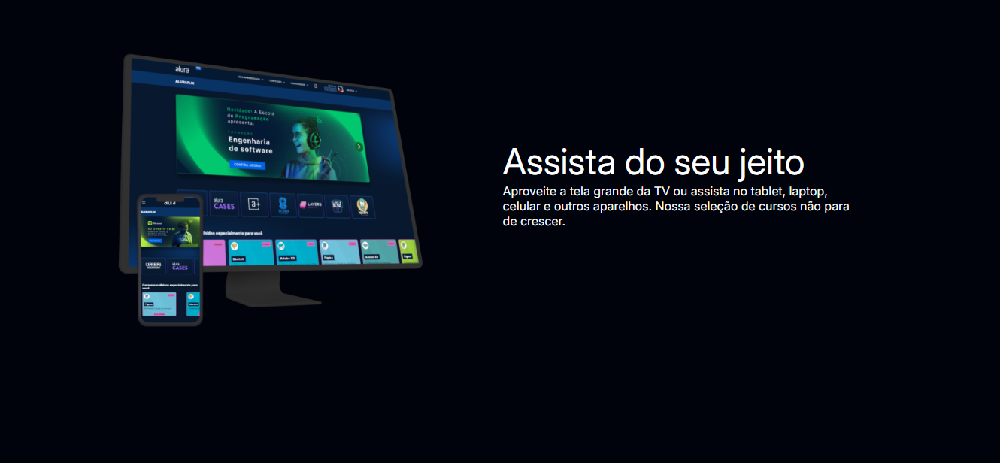
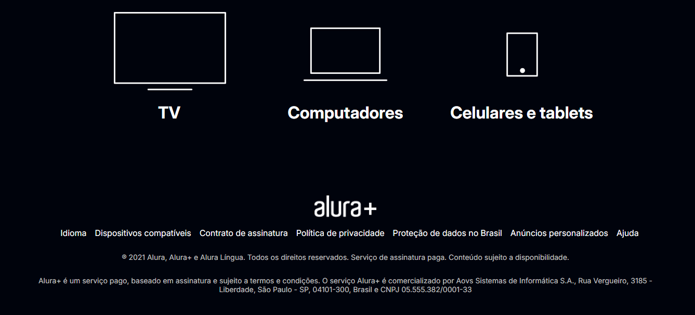

<h1 align="center" style="font-weight: bold;">AluraPlus 🖥️➕ </h1>

  
  

 <a href="#about">Sobre</a> • 
 <a href="#started">Imagens</a> • 

<h2 id="started">📌 Sobre</h2>

Projeto do curso de "HTML e CSS: praticando HTML/CSS", da Alura. 

 
<a href="https://aluraplus-awtevlouk-diane-kaori-tairas-projects.vercel.app/" target="_blank">Link para o projeto</a>

<h2 id="started">📷 Imagens</h2>

